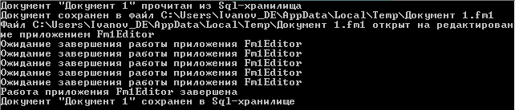

### Реализовать приложение для редактирования документов из хранилища

Document - это объект, содержащий идентификатор, имя документа, содержимое и информацию о формате содержимого.

### Алгоритм просмотра документа состоит из последовательности стандартных шагов:

1. загрузки документа из хранилища,
2. сохранения документа в файл на локальном диске,
3. открытия документа с помощью приложения, ассоциированного с форматом файла,
4. цикла отслеживания завершения работы приложения,
5. сохранения документа в хранилище.

### В зависимости от формата файла могутсуществовать свои особенности реализации некоторых шагов алгоритма.

Например,

открытие документа формата .fm1 выполняется с помощью запуска программы приложения Fm1Editor.exe, а отслеживание завершения определяется по наличию процесса fm1Editor.exe в памяти.

Открытие документа формата .fm2 выполняется с помощью обращения к COM-серверу приложения Fm2Editor.exe, а отслеживание завершения работы приложения выполняется через COM-интерфейсы.

Работа с хранилищами документов выполняется через провайдеры хранилищ, реализующие методы чтения, сохранения и удаления документов в соответствии со спецификой хранилища.

Для ускорения работы приложения документы кешируются в памяти приложения.

**Подсказка:**
обращений к каким-либо реальным приложениям и COM-серверам или их заглушкам, не требуется, эмулируйте эти обращения в виде вывода сообщений в консоль. Ожидание завершения редактирования эмулируйте циклом из нескольких итераций с выводом сообщений в консоль.

### Примерный «выхлоп» приложения в консоль:

